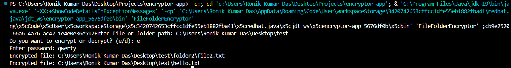
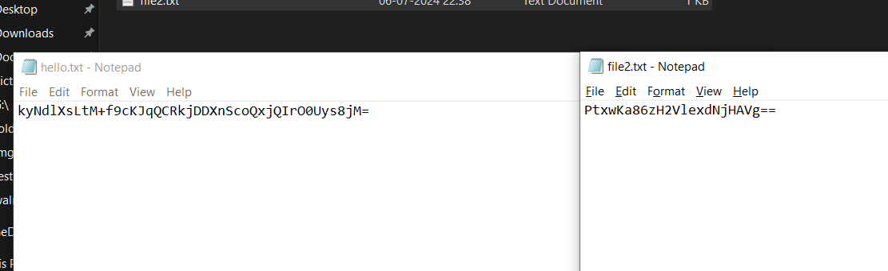
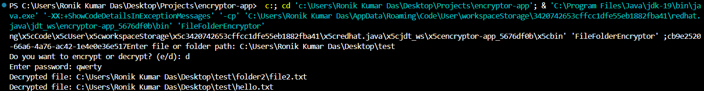
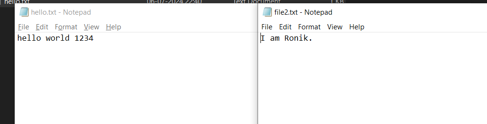

### README.md

---

# Java AES File Encryption and Decryption

This project demonstrates file and folder encryption and decryption using AES algorithm in Java. It allows you to encrypt files and folders using a password, and decrypt them using the same password.

### Screenshots

1. **Encryption in Terminal**
   
   
2. **Encrypted File Screenshot**
   
   
3. **Decryption in Terminal**
   
   
4. **Decrypted File Screenshot**
   

### How to Use

1. **Setup**
   - Clone this repository to your local machine.

2. **Run the Program**
   - Open the project in your preferred Java IDE or editor (e.g., IntelliJ IDEA, Eclipse, VSCode).
   - Navigate to the `FileFolderEncryptor.java` file.
   - Update the file with your desired encryption and decryption logic.
   - Compile and run the `FileFolderEncryptor.java` file to execute the program.

3. **Usage**
   - When prompted, enter the file or folder path you want to encrypt or decrypt.
   - Choose whether to encrypt or decrypt the file/folder.
   - Enter a password for encryption and decryption.
   - The program will encrypt or decrypt the file/folder and save the result in the same location.

---